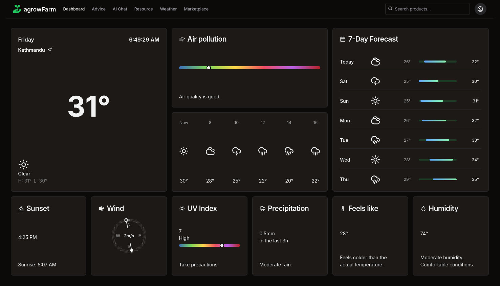

# 🌾 agrowFarm - Frontend Showcase for Agricultural Advice Platform


**agrowFarm** is a frontend development showcase project demonstrating a mock AI-powered agricultural advice platform. This project highlights advanced frontend technologies and design patterns.



## ✨ Features

- 🌦 **Weather Updates UI:** Interface for displaying real-time weather forecasts.
- 🤖 **AI Chatbot UI:** Mockup for an AI chatbot interaction.
- 📚 **Resource Library UI:** Design for an extensive library of agricultural resources.
- 🌱 **Personalized Advice UI:** Mock interface for receiving tailored advice based on user input.
- 🛒 **Marketplace UI:** E-commerce design for agricultural products.

## 🚀 Installation

Follow these steps to get started with agrowFarm:

1. **Clone the repository:**

   ```sh
   git clone https://github.com/isunp/agrowFarm.git
   cd agrowFarm
   ```

2. **Install dependencies:**

   ```sh
   npm install
   ```

3. **Run the development server:**

   ```sh
   npm run dev
   ```

## 📞 Contact

For inquiries or support, please contact:

- ** aopsz **
  - 📧 [opswithtej@gmail.com](mailto:opswithtej@gmail.com)

---
